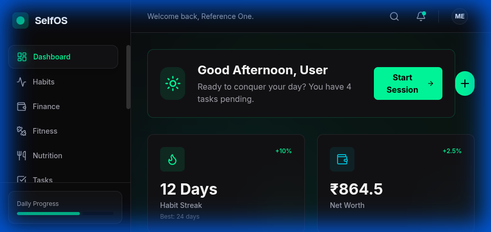
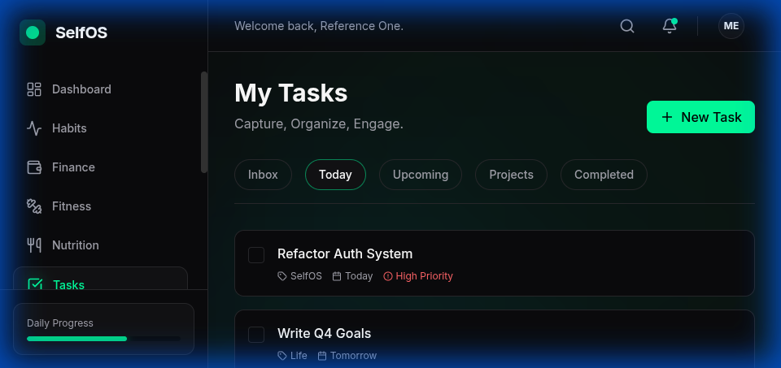
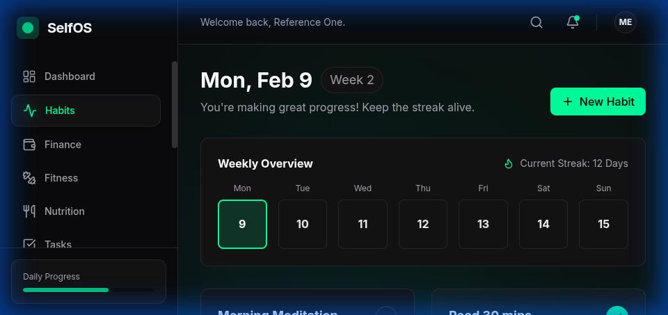
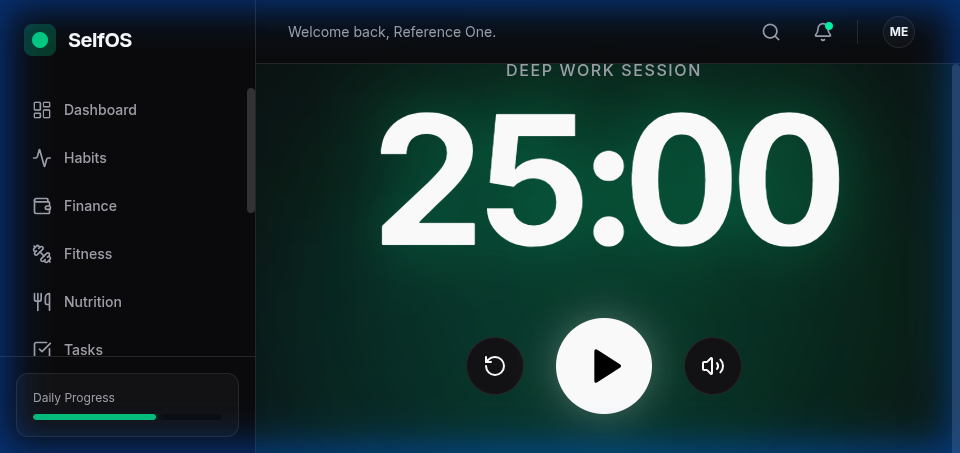
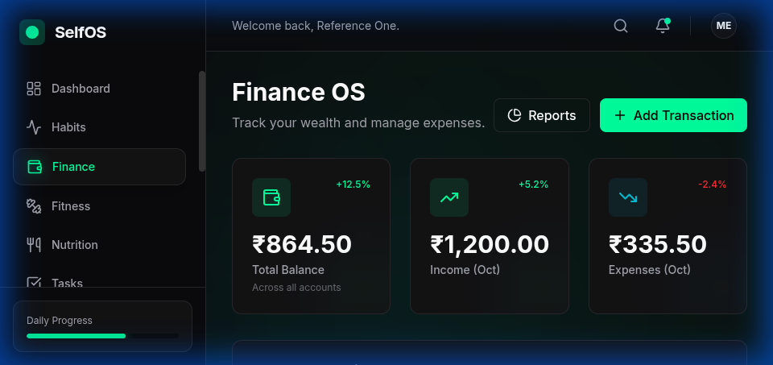

<<<<<<< HEAD
# SelfOS
Self OS — An open-source life operating system inspired by LifeOS Dashboard, designed to help individuals organize goals, tasks, habits, and self-reflection in one unified system.
=======
# SelfOS - Your Mindful Personal Operating System

SelfOS is a minimalist, intentional, and feature-rich personal dashboard designed to help you manage your life with clarity and focus. Built with SvelteKit and Tailwind CSS, it provides a seamless experience for tracking tasks, habits, finances, and focus sessions.

---

## 📸 Screenshots

### Dashboard



### Tasks Management



### Habit Tracking



### Focus Zen Mode



### Finance Tracker



---

## ✨ Key Features

- **🎯 Mindful Dashboard**: A clean overview of your day, highlighting what's important.
- **✅ Task Management**: Organize your todos with ease and clarity.
- **📅 Habit Tracking**: Build and maintain long-term habits with a visual progress tracker.
- **🧘 Focus Zen Mode**: A distraction-free timer to help you enter flow state.
- **💰 Finance Tracker**: Keep track of your expenses and stay on top of your financial health.
- **📱 Responsive Design**: Fully optimized for both desktop and mobile devices.
- **🔒 Local-First**: Your data stays on your device, ensuring privacy and speed.

---

## 🛠️ Tech Stack

- **Framework**: [SvelteKit](https://kit.svelte.dev/) (Svelte 5)
- **Styling**: [Tailwind CSS](https://tailwindcss.com/)
- **Icons**: [Lucide Svelte](https://lucide.dev/guide/svelte)
- **Build Tool**: [Vite](https://vitejs.dev/)
- **Types**: [TypeScript](https://www.typescriptlang.org/)

---

## 🚀 Getting Started

### Prerequisites

- Node.js (v18 or higher)
- npm (or pnpm / yarn)

### Installation

1. **Clone the repository**:

   ```sh
   git clone https://github.com/AnshumSrivastava/SelfOS.git
   cd SelfOS
   ```

2. **Install dependencies**:

   ```sh
   npm install
   ```

3. **Start the development server**:

   ```sh
   npm run dev
   ```

4. **Build for production**:

   ```sh
   npm run build
   ```

---

## 📂 Project Structure

```text
SelfOS/
├── src/
│   ├── lib/          # Reusable components and logic
│   │   ├── components/ # UI components (Layout, UI, etc.)
│   │   ├── stores/     # Svelte stores for state management
│   │   └── utils/      # Helper functions
│   ├── routes/       # Application pages (Dashboard, Tasks, etc.)
│   └── app.html      # Main HTML entry point
├── static/           # Static assets (images, favicon, etc.)
├── screenshots/      # Project screenshots for documentation
└── tailwind.config.ts # Tailwind CSS configuration
```

---

## 🤝 Contributing

Contributions are welcome! If you'd like to improve SelfOS, please feel free to:

1. Fork the project.
2. Create your feature branch (`git checkout -b feature/AmazingFeature`).
3. Commit your changes (`git commit -m 'Add some AmazingFeature'`).
4. Push to the branch (`git push origin feature/AmazingFeature`).
5. Open a Pull Request.

---

## 📄 License

This project is licensed under the MIT License - see the `LICENSE` file for details.

---

*Built with ❤️ for a more mindful life.*
>>>>>>> fa3ef3c (chore: initial commit with comprehensive documentation and screenshots)
